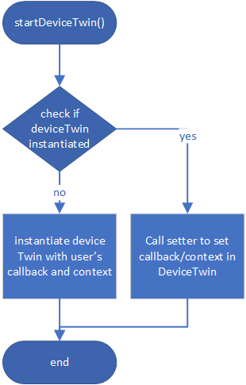
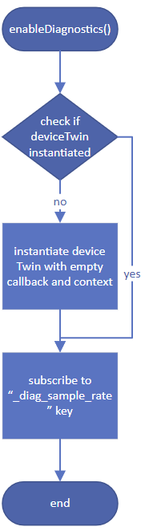

# Design specification for E2E Diagnostic in Java SDK

## Introduction

### 1.What we do?
Customers would like to track end-to-end flow of a message. They want to troubleshoot where the error happens of a message, or track message across multiple Azure services.

### 2.Concern
Considering it needs cost for sending diagnostic info, there’s one option provided for user to configure the diagnostic for each device: the sampling percentage which indicates percentage of D2C messages that will carry diagnostic data.

## Definition

### Data structure

#### 1.Diagnostic Info
The following table describes the names and format of diagnostic related properties in detail.

| System Property Name | MQTT Property Name | Property Purpose                          | Property Value Format                                    | Property Value Sample                        |
|----------------------|--------------------|-------------------------------------------|----------------------------------------------------------|----------------------------------------------|
| Diagnostic-Id              | $.diagid           | Track the message in consequent flow      | 8 characters, [a-z0-9]8                                  | "8cd869z4"                                   |
| Correlation-Context  | $.diagctx             | Context contains multiple key-value pairs | Comma separated list of key-value, it is RFC2396 encoded | “creationtimeutc=2017-02-22T01:01:01Z,hop=2” |

| Property Name in Correlation-Context                                               | Property Purpose                                        | Property Value Format | Property Value Sample      |  
|------------------------------------------------------------------------------------|---------------------------------------------------------|-----------------------|----------------------------|
| creationtimeutc                                                                    | Timestamp when creating message                         | UTC time string       | "2017-02-22T03:27:28.633Z" |
| hop * it is necessary only in gateway scenario, not covered in current implementation.                                                                               | The number of nodes/services that the message pass thru | Integer string        | “2”                        |

#### 2.Dianostic setting
We provide 2 ways to set the diagnostic settings(sampling percentage). The first way is to set locally in code. The second is fetch from device twin. Here gives the data structure of desired twin:

    {
      _diag_sample_rate: '0-100'
    }

And after the device side get the desired twin, it will set related value and report the settings applied to the device.

    {
      _diag_sample_rate: '<CURRENT VALUE ON DEVICE>',
      _diag_info: '<ERROR MESSAGE IF DESIRED TWIN INVALID>'
    }

### Flow
If user call DeviceClient.enableDiagnostics(), that means we will start a device twin and subscribe to desired property "_diag_sample_rate". The DeviceTwin instance in DeviceClient provides the function for device twin. Here are several features about the DeviceTwin instance.
1. DeviceTwin has **ONLY ONE** status callback/ context, generic callback/ context. They are set in the constructor and can not be changed.
2. DeviceTwin has a property callback map where user can add multiple callbacks for specific key.
3. If defines more than one DeviceTwin instances in DeviceClient, they will conflict.

In order not to conflict with user's device twin callbacks, we will make some changes to the DeviceTwin class, **add setters for status callback/ context, generic callback/ context**.

Here're flow chart for user journey. If user does not use twin in their code, we will instantiate a new DeviceTwin instance. If user uses twin, according to the sequence of calling enableDiagnostics() and startDeviceTwin(), the logic will be slightly different.

#### Flow of startDeviceTwin()

#### Flow of enableDiagnostics()

### Interface and class
    class DeviceClient
    {
        // To provide function of diagnostics
        private DeviceClientDiagnostic deviceDiagnostic;

        // Calling enableDiagnosticsFromLocalSetting will set diagnostic setting from local
        public void enableDiagnosticsFromLocalSetting(int percentage);

        // Calling enableDiagnosticsFromCloudSetting will set diagnostic setting from cloud(device twin)
        // If twin is not started, it will start a device twin with empty callback.
        // Then it will subscribe to desired key: _diag_sample_rate.
        public void enableDiagnosticsFromCloudSetting();
    }

    class DeviceClientDiagnostic
    {
        private int diagSamplingPercentage;
        private int currentMessageNumber;

        public DeviceClientDiagnostic();
        public int getDiagSamplingPercentage();
        public void setDiagSamplingPercentage(int diagSamplingPercentage);
        
        // Callback of desired twin property "_diag_sample_rate" update.
        // It will read the twin value. If valid, update sampling rate. If not, prepare error message.
        // Then it will send reported properties to report current applied sampling rate and error message.
        /**
         * It will start a new thread to update reported properties.
         * If update reported properties in the same thread of desired property callback, the addMessage will wait for the same lock
         * of invokeCallbacks(in MqttTransport) and cause dead lock.
         */
        public PropertyCallBack<String, Object> twinPropertyCallback;

        // To decide if this message would attach diagnostic information.
        // For example, if sampling rate is 80, then every 8 of 10 messages will attach diagnostic information.
        // We would like to have stable behavior so we won't use random possibility to handle this part.
        public void addDiagnosticInfoIfNecessary(Message message);
    }

    class Message
    {
        // According to our general design, here diagnostic properties should be add to system properties, but in Java SDK, there isn't message properties member in Message class. So define 2 more private members here.
        private String diagnosticId;
        private String diagnosticCorrelationContext;
    }

    class AmqpsDeviceTelemetry
    {
        // Add diagnostic info(if exist) to AMQP message annotations
        protected MessageImpl iotHubMessageToProtonMessage(Message message);
    }

    class MqttMessaging
    {
        // Add diagnostic info(if exist) to MQTT properties
        public void send(Message message);
    }

